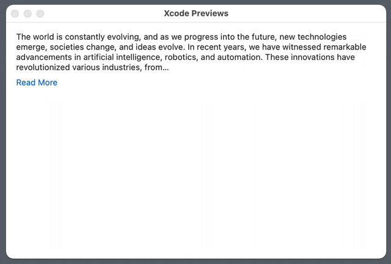

# ExpandableText
A SwiftUI component that shows a collapsed text with the ability to expand it.



## Installation
ExpandableText is available through [Swift Package Manager](https://swift.org/package-manager).

```swift
.package(url: "https://github.com/MrAsterisco/ExpandableText", from: "<see GitHub releases>")
```

### Latest Release
To find out the latest version, look at the Releases tab of this repository.

## Usage
You can create a `ExpandableText` view by passing a `String` to it. The text will be collapsed by default if it's longer than the specified characters limit.

```swift
ExpandableText(
	content: "Paste some very long text here!",
	readMoreView: {
		Button("Read More", action: $0)
			.buttonStyle(.link)
	}
)
```

The `readMoreView` closure gets a parameter that should be invoked when your view is triggering the expansion. The view will automatically disappear when the text is not collapsed.

By default, your content is represented using a `Text` view, but you can specify another view by passing a closure as `contentView`. You can also customize the characters limit by passing a different value to `charactersLimit`.

When the text is collapsed, a `…` character is added automatically at the end.

## Compatibility
ExpandableText is compatible with **iOS 15 or later**, **macOS 10.15 or later**, **watchOS 8 or later**, **tvOS 15 or later**, and **VisionOS 1 or later**.

## Contributions
All contributions to expand the library are welcome. Fork the repo, make the changes you want, and open a Pull Request.

If you make changes to the codebase, I am not enforcing a coding style, but I may ask you to make changes based on how the rest of the library is made.

## Status
This library is under **active development**. Even if most of the APIs are pretty straightforward, **they may change in the future**; but you don't have to worry about that, because releases will follow [Semantic Versioning 2.0.0](https://semver.org/).

## License
ExpandableText is distributed under the MIT license. [See LICENSE](https://github.com/MrAsterisco/ExpandableText/blob/main/LICENSE) for details.
